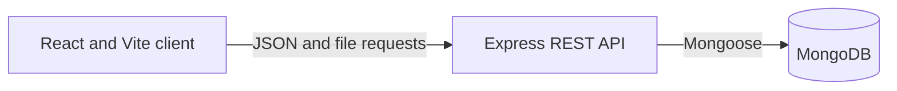

# Personalized Finance Tracker

A full stack personal finance application for recording income and expenses, reviewing cash flow, and setting monthly spending budgets. Built as a university project and refined as a practical portfolio project with a React client and an Express/MongoDB API.

## Features

- Account registration and login with bcrypt password hashing and expiring JWT sessions.
- User scoped income and expense records with create, edit, delete, and date/category search.
- Dashboard totals, recent activity, and charts based on the signed-in user's records.
- Monthly category budgets with spending progress and budget threshold notices.
- Excel downloads for the signed-in user's income or expense records.
- Optional profile image upload with a 5 MB limit.

Amounts are displayed in dollars in the current interface. The app does not connect to bank accounts or provide financial advice.

## Tech Stack

- **Frontend:** React, Vite, React Router, Tailwind CSS, Axios, Recharts, React Icons, Moment, react-hot-toast
- **Backend:** Node.js, Express
- **Database:** MongoDB with Mongoose
- **Authentication:** JSON Web Tokens and bcryptjs
- **Other:** Multer for profile images; SheetJS (`xlsx`) for Excel exports

## Architecture



The frontend and backend are separate deployments. Protected API routes derive the user identity from the verified JWT, and transaction and budget queries are scoped to that identity.

## Project Structure

```text
client/
  src/pages/             Authentication and dashboard pages
  src/components/        Forms, navigation, transaction cards, and charts
  src/context/           Signed-in user state
  src/utils/              API paths, Axios client, and formatting helpers
server/
  routes/                 REST endpoint definitions
  controllers/            Authentication, dashboard, transaction, and budget logic
  models/                 Mongoose schemas
  middleware/             JWT authentication and image upload handling
  config/                 MongoDB connection
```

## Getting Started

### Requirements

- Node.js 20 or newer
- npm
- A MongoDB database (local or hosted)

### Install

```bash
git clone https://github.com/ZI-Tasin/Personalized-Finance-Tracker.git
cd Personalized-Finance-Tracker
npm --prefix server install
npm --prefix client install
```

Create `server/.env` from `server/.env.example`. Optionally create `client/.env` from `client/.env.example` if the API is not running on the local default URL.

Start the API and client in separate terminals:

```bash
cd server && npm run dev
```

```bash
cd client && npm run dev
```

The Vite client runs at `http://localhost:5173` and the API defaults to `http://localhost:5000`.

## Environment Variables

### Backend (`server/.env`)

| Variable | Purpose |
| --- | --- |
| `MONGO_URL` | MongoDB connection string |
| `JWT_SECRET` | Secret used to sign session tokens; use a long random value and keep it private |
| `PORT` | API port (defaults to `5000`) |
| `CLIENT_URL` | Allowed frontend origin for CORS; comma-separated origins are supported |

### Frontend (`client/.env`)

| Variable | Purpose |
| --- | --- |
| `VITE_API_BASE_URL` | Backend origin, for example `http://localhost:5000`; defaults to this local URL |

Vite exposes `VITE_` variables in browser code, so never put secrets in the client environment.

## API Overview

All API endpoints use the `/api/v1` prefix. Registration and login are under `/auth`; protected endpoints cover the dashboard, income, expenses, and budgets. Income and expense routes support list, create, update, delete, and Excel download operations. Protected requests use `Authorization: Bearer <token>`. `GET /api/health` is a basic process health check.

## Deployment

Deploy `client/` as a Vite frontend (for example, on Vercel) and `server/` as a Node service (for example, on Render). Configure `VITE_API_BASE_URL` to the deployed API origin and configure the backend `CLIENT_URL` with the deployed frontend origin. Set `MONGO_URL`, `JWT_SECRET`, and `PORT` in the backend host environment. Uploaded profile images are stored on the backend filesystem; check the host's filesystem persistence before relying on uploaded images across restarts.

## Future Improvements

- Add automated API and component tests.
- Add import support with row-level validation and a review step.
- Make display currency configurable.
